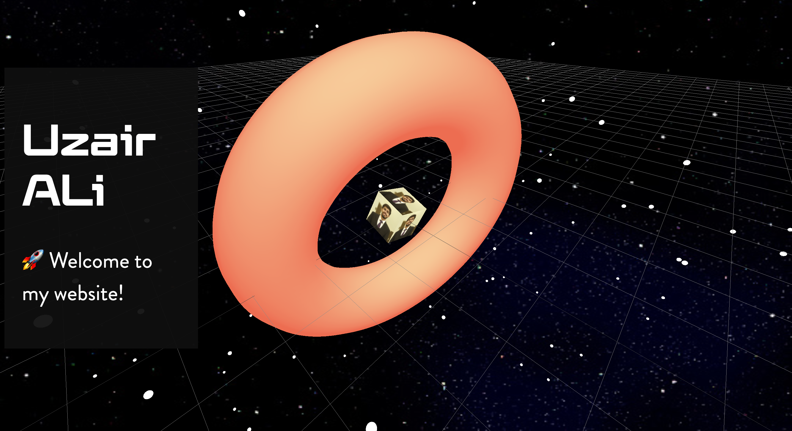

# Three.js Beginner Portfolio

> This is a initial starter project for me to learn threejs and the utility that it offers. The ultimate goal is to build a completely immersive website with threejs.



The project learning points are:

- Geometry
- Materials
- Textures
- Mesh
- Light Systems
- Debugging with dat.gui
- User interaction with mouse events

## Built With

- Threejs
- Vite
- Node Package Manager

## Live Demo

[Live Demo Link](https://uzairali19.github.io/beginner-protfolio)

## Getting Started

To get a local copy up and running follow these simple example steps:

### Setup

Download [Node.js](https://nodejs.org/en/download/).
Run this followed commands:

```bash
# Install dependencies (only the first time)
npm install

# Run the local server at localhost:8080
npm run dev

# Build for production in the dist/ directory
npm run build
```

## Authors

👤 **Author1**

- GitHub: [@uzairali19](https://github.com/uzairali19)
- Twitter: [@uzairali751](https://twitter.com/Uzairali751)
- LinkedIn: [LinkedIn](https://www.linkedin.com/in/uzairali19/)

## 🤝 Contributing

Contributions, issues, and feature requests are welcome!

Feel free to check the [issues page](https://github.com/uzairali19/beginner-protfolio/issues/).

## Show your support

Give a ⭐️ if you like this project!

## Acknowledgments

- Shout out to Bruno Simon who has inspired me to follow this path. If you want to learn his extensive course check out. [Threejs Journey](https://threejs-journey.xyz/)

## 📝 License

This project is [MIT](./MIT.md) licensed.
